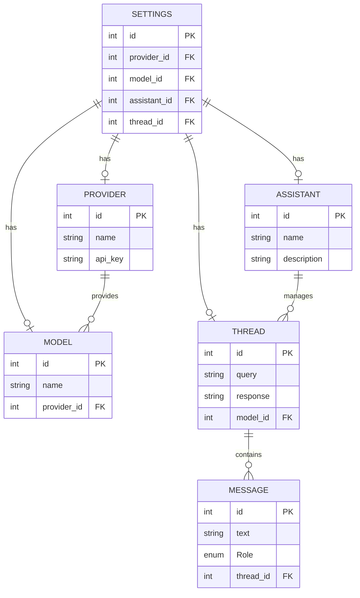

# SEEKS

**SEEKS** is a shell program and manages the execution of AI-based systems. It is a structured execution environment that allows the user to interact with the AI-based system and manage the execution of the system. The program is designed to be modular and can be extended to support different types of AI-based systems.

## Motivation

The motivation for this project is twofold:
1. To provide a structured execution environment for AI-based systems - ie. OpenAI's GPT-3, Anthropic's Claude, etc.
2. To develop skills in database management, data processing, and python programming in general.

## Name

The name **SEEKS** is an abbreviation play on the title "Structured Execution Environment of Knowledge Systems". It is also part of the name of a character being who appeared in the episode [Meeseeks and Destroy](https://www.imdb.com/title/tt3333832/) of the Rick and Morty series, where Beth, Summer and Jerry try to get their every wish fulfilled by asking mr. Meeseeks. Which resembles the usage of AI-based systems to fulfill our every wish. The name **SEEKS** is a homage to that episode.

## Installation

Use the following command to install the project:

```bash
make install
```

## Usage

Use the following command to run the project:

```bash
make run # to initiate the shell program
```

The run command will initiate the shell program. The first thing that is required, is to register the components:

- **Provider** (ie. OpenAI, Anthropic, etc.)
- **Model** (ie. GPT-3, Claude, etc.)
- **Assistant** (optional as default assistant is provided)

Once registered, the user can interact with the AI-based system by sending a query to the system. The system will then process the query and return the response. All responses are stored in the database as **Threads** for future reference.


**SEEKS** is designed to be modular and can be extended to support different types of AI-based systems. A conscious decision was made to keep the system flexible and allow for easy extension. This comes with the tradeoff of being less user-friendly and more complex to use. However with a little bit of practice, the user can easily interact with the system. Or perhaps ask Mr. Meeseeks to help out. :stuck_out_tongue_winking_eye:

## Design

The design of the system is based on the following components:

| Component | Description                                                                                                                                                                                                         |
| --------- | ------------------------------------------------------------------------------------------------------------------------------------------------------------------------------------------------------------------- |
| Provider  | The provider is the company that provides the AI-based system. The provider is responsible for managing the API keys and the connection to the AI-based system.                                                     |
| Model     | The model is the AI-based system that is provided by the provider. The model is responsible for processing the queries and returning the responses.                                                                 |
| Assistant | The assistant is an optional component that can be used to prescribe the queries to the AI-based system. A prescription could take the form of a template or a set of rules that the AI-based system should follow. |
| Thread    | The thread is a record of the interaction between the user and the AI-based system. The thread is used to progress the conversation with the AI-based system and to store the responses for future reference.       |
| Settings  | The settings are the configuration of the system. The settings are used to manage the components of the system and to configure the system for the user.                                                            |



Always good to visualize the design of the system. :sunglasses:

## Development

- [ ] Implement template function in Labels class
- [ ] Implement logger of system that saves in .seeks/logs

## License

This project is licensed under the MIT License - see the [LICENSE](LICENSE) file for details.

## Acknowledgements

- [Rick and Morty](https://www.imdb.com/title/tt2861424/)
